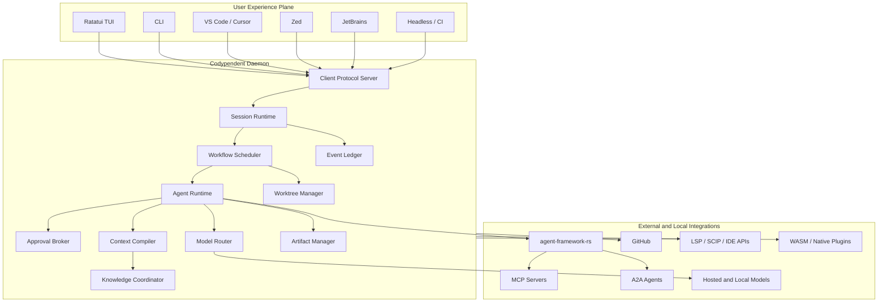

# System Architecture

## Topology



## Logical layers

### Experience plane

The experience plane renders state and submits commands. It does not own workflow truth.

Each client advertises capabilities:

```rust
pub struct ClientCapabilities {
    pub rich_text: bool,
    pub image_display: bool,
    pub audio_capture: bool,
    pub editor_mutations: bool,
    pub diff_view: bool,
    pub mouse: bool,
    pub unicode: bool,
    pub true_color: bool,
}
```

The daemon uses these capabilities to send suitable projections and interaction requests.

### Control plane

The daemon control plane manages:

- sessions and client attachment;
- command validation;
- policy decisions;
- workflow scheduling;
- approvals and budgets;
- durable event ordering;
- recovery and reconciliation.

### Execution plane

The execution plane performs side effects:

- model requests;
- shell commands;
- file operations;
- Git operations;
- GitHub requests;
- plugin calls;
- MCP tools;
- worktree services.

Every execution receives a scoped capability grant and emits a trace.

### Knowledge plane

The knowledge plane maintains:

- source documents and CRDT state;
- code symbol and dependency graph;
- memories and their provenance;
- full-text and vector indexes;
- registry metadata;
- artifact references.

It is logically unified but physically composed from several stores.

## Process model

The initial local deployment uses:

```text
codypendent              TUI/CLI executable
codypendentd             persistent daemon
language servers         existing child processes
MCP/native plugins       supervised child processes
local model servers      external or daemon-managed
```

Heavy indexing and evaluation tasks may run as daemon worker tasks before being split into separate processes.

## Initial storage model

### SQLite in WAL mode

SQLite is the authoritative local metadata and event store for the single-user product:

- sessions;
- runs;
- events;
- commands;
- workflow nodes;
- approvals;
- registry metadata;
- memories;
- graph nodes and edges;
- usage and budgets.

A server deployment can later provide a PostgreSQL implementation behind the same repository traits.

### Content-addressed artifact store

Large content is stored outside rows:

```text
~/.local/share/codypendent/artifacts/sha256/<prefix>/<hash>
```

Artifacts include:

- model responses;
- shell output;
- images and audio;
- patches and diffs;
- snapshots;
- index segments;
- exported documents.

### Derived indexes

- **ripgrep**: immediate exact search over current files.
- **Tantivy**: local BM25/full-text index.
- **Vector index**: embedded implementation initially or Qdrant where appropriate.
- **Graph projection**: SQLite edge tables initially; optional graph database only after measured need.

## Internal module boundaries

```text
protocol
  Wire types, IDs, envelopes, API versioning.

daemon
  Persistence, command handling, subscriptions, recovery.

runtime
  Agent runs, workflows, approvals, models, context, compaction.

knowledge
  Skills, memory, documents, search, code index, graph.

integrations
  GitHub, MCP, A2A, IDE bridges, providers, local models.

sandbox
  Capability grants, process isolation, plugin runtimes.

tui
  Rendering, input, layout, components, themes.

cli
  Non-interactive commands and machine-readable output.
```

A module becomes a new crate only for a real reason: separate distribution, optional heavy dependencies, security isolation, independent versioning, or compile-time benefit.

## Authority model

The authoritative source depends on the entity:

| Entity | Authority |
|---|---|
| Repository content | Git worktree and filesystem |
| Workflow state | transactional event ledger |
| Collaborative draft | CRDT document |
| Published documentation | Git snapshot |
| Large execution output | artifact store |
| Search result | derived index plus source citation |
| Code relationship | graph edge plus evidence |
| Plugin permission | policy engine |
| IDE selection | most recent client observation |
| Cost | recorded provider usage and pricing snapshot |

No derived layer may silently overwrite its authority.

## Expanded product services

Comparative product research adds four daemon services:

- **ChangeSet Manager:** ordered patch stacks, selective apply, rebase and publication.
- **Hook Engine:** lifecycle observers, validators, policy hooks and agent evaluators.
- **Runner Broker:** local, LAN and future hosted execution environments.
- **Chronicle Builder:** structured session narrative generated from durable events.

The experience plane gains plan/spec editing, session branch comparison, change-set review, status-line projection, notifications and browser evidence viewing.
